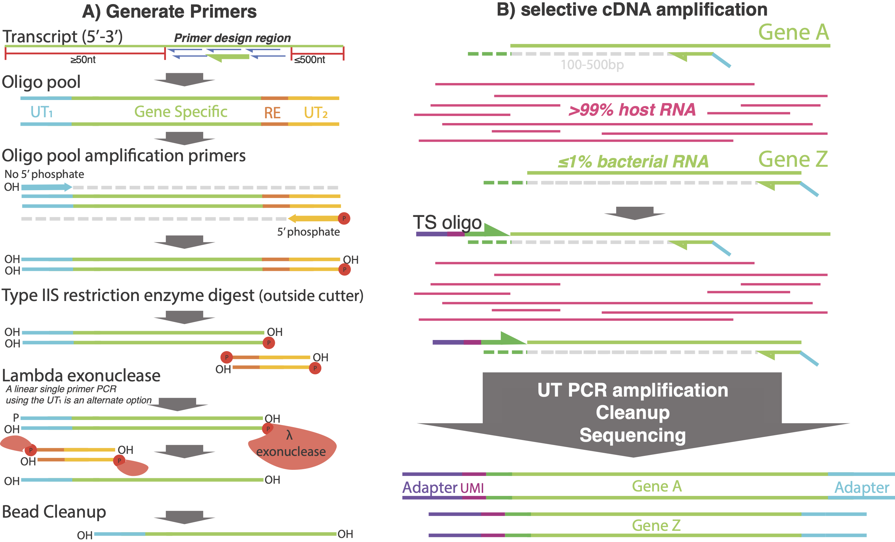

# STOPseq




This takes in various genomes fastas and makes the primers require for STOPseq (slective transcriptomics of pathogens).

# Installation

 - [bowtie](https://bowtie-bio.sourceforge.net/index.shtml)
 - [samtools](http://www.htslib.org/)
 - [primer3](https://github.com/primer3-org/primer3)

 - [R software](https://www.r-project.org/)
 - R packages
    - stringr
    - biostrings
    - openprimeR
 - python3
    - pandas
    - io.Seq


# Usage

```bash
bash make_primers.sh \
	--foreground "path to multifasta of desired gene targets" \
	--miss_lib "path to multifasta containing rRNAs" \
	--background "path to muiltifasta of background (host) transcriptome"
```

### Options

| Flag             | Description                                                                                                                                                     |
|------------------|-----------------------------------------------------------------------------------------------------------------------------------------------------------------|
| -t\|--threads    | number of threads to use (default = 4)                                                                                                                          |
| -n\|--name       | name for primer library                                                                                                                                         |
| -m\|--miss_lib   | a multifasta containing all the rRNAs that may be present in the sample (required)                                                                              |
| -b\|--background | a multifasta containing all the background transcripts that may be present in the sample (required)                                                             |
| -f\|--foreground | a multifasta containing all the transcripts of intrest present in the sample, should have rRNAs removed althoug this is also done using a basic grep (required) |
| -mt\|--min_tm    | minimum primer Tm (default = 50)                                                                                                                                |
| -ot\|--opt_tm    | optimum primer Tm (default = 50)                                                                                                                                |
| -mxt\|--max_tm   | maximum primer Tm (default = 80)                                                                                                                                |
| -ml\|--min_len   | minimum primer length (default = 8)                                                                                                                             |
| -ol\|--opt_len   | optimum primer length (default = 13)                                                                                                                            |
| -mxl\|--max_len  | maximum primer length (default = 20)                                                                                                                            |
| -o\|--out_dir    | path to output directory                                                                                                                                        |
| -s\|--Script_dir | path to script directory                                                                                                                                        |